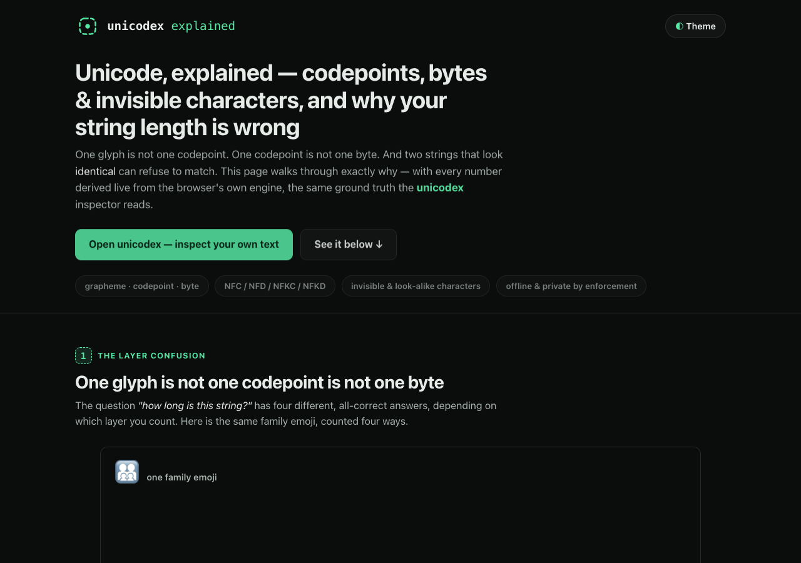

# Unicode, explained — codepoints, bytes & invisible characters

**An animated, single-page walkthrough of [unicodex](https://sreenivas-sadhu-prabhakara.github.io/unicodex/),
the Unicode character inspector: why one glyph is not one codepoint or one byte, why your string length is
"wrong", and how invisible and look-alike characters make identical-looking strings refuse to match — with
every number on the page derived live from the browser's own engine.**



- **This explainer:** https://sreenivas-sadhu-prabhakara.github.io/unicodex-explained/
- **The live app it explains:** https://sreenivas-sadhu-prabhakara.github.io/unicodex/
  ([app source](https://github.com/Sreenivas-Sadhu-Prabhakara/unicodex))

## What's on the page

Five scroll-driven scenes, each teaching one piece of the mechanism (pure CSS animation + inline SVG,
no libraries — the CSP forbids external and inline script beyond `app.js`):

1. **One glyph ≠ one codepoint ≠ one byte** — the family emoji 👨‍👩‍👧‍👦 counted four ways as the
   layers grow: **1** grapheme cluster, **7** codepoints, **11** UTF-16 units, **25** UTF-8 bytes.
2. **Invisible characters, revealed** — ZERO WIDTH SPACE, RIGHT-TO-LEFT OVERRIDE (the Trojan-Source trick)
   and NO-BREAK SPACE, each shown inside the unicodex **reveal box**: a dashed mint frame with the
   abbreviation in monospace.
3. **The normalization diff** — canonical (NFC ↔ NFD, the twin `café`) versus compatibility
   (NFKC/NFKD, the `fi` ligature decomposing to `fi`).
4. **Look-alikes** — the Cyrillic-`р`+`а` "раypal" spoof that reads perfectly but is never equal to the
   Latin word, before or after normalization.
5. **Why is my string length wrong?** — the straight answer: four tools, four correct numbers, on that
   one emoji.

Plus an enforced-privacy section, honest limits, and a CTA to the live app.

`prefers-reduced-motion` collapses every animation to its final, fully legible state. Light and dark
themes are both WCAG-AA (contrast verified against the actual tokens, not eyeballed); everything is
keyboard-operable with a skip link and visible focus rings.

## Numbers you can trust — derived, never fabricated

Not a single count on this page is typed by hand. `data/facts.js` fixes only the **input strings** (as
explicit codepoint arrays) and derives every number from the host engine — the exact primitives unicodex
is a window onto:

- `[...s].length` → codepoints · `s.length` → UTF-16 units · `TextEncoder` → UTF-8 bytes
- `Intl.Segmenter` → grapheme clusters · `String.normalize` → NFC/NFD/NFKC/NFKD

`app.js` fills the on-page figures from that module at load, so the page cannot drift from ground truth,
and `test/facts.test.js` re-derives the same numbers a second, independent way.

## Quickstart

No build step, no dependencies.

```sh
git clone https://github.com/Sreenivas-Sadhu-Prabhakara/unicodex-explained.git
cd unicodex-explained
open index.html        # or serve statically: python3 -m http.server 8000
```

Run the self-tests (Node 20+):

```sh
node --test
```

The tests re-derive, from Node's own `TextEncoder` / `Intl.Segmenter` / `String.normalize`, that:
the family emoji is 1 / 7 / 11 / 25; `café` is 4 codepoints in NFC and 5 in NFD (and equal only after
normalizing); the `fi` ligature becomes `file` only under NFKC; and the Cyrillic "раypal" never equals
the Latin "paypal".

## Privacy

Same guarantee as the app it explains: this page ships a strict Content-Security-Policy with
`connect-src 'none'`, so **the browser itself blocks every network request** — it is policy, not promise.
No server, no account, no analytics, no external fonts or scripts, no remote images. The only thing
stored is your theme choice, in this browser's `localStorage`.

## Disclaimer

This explainer and the unicodex app are informational developer tools provided **"as is"**, without
warranty of any kind. Character counts and normalization come from your browser's engine and can differ
across engines and Unicode versions. The flagged-character catalogs in the app are curated subsets, so
the absence of a warning is never proof that text is safe, and neither tool issues a security verdict.
Verify anything important yourself. The author accepts no liability for decisions made using these tools.

## License

[MIT](LICENSE) © 2026 Sreenivas Sadhu Prabhakara
